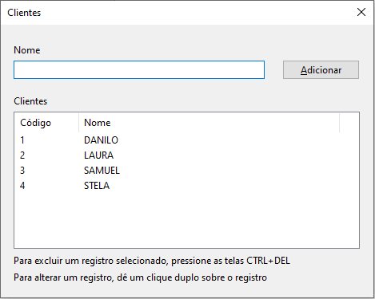
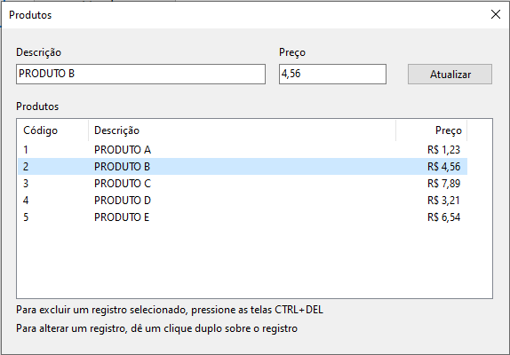
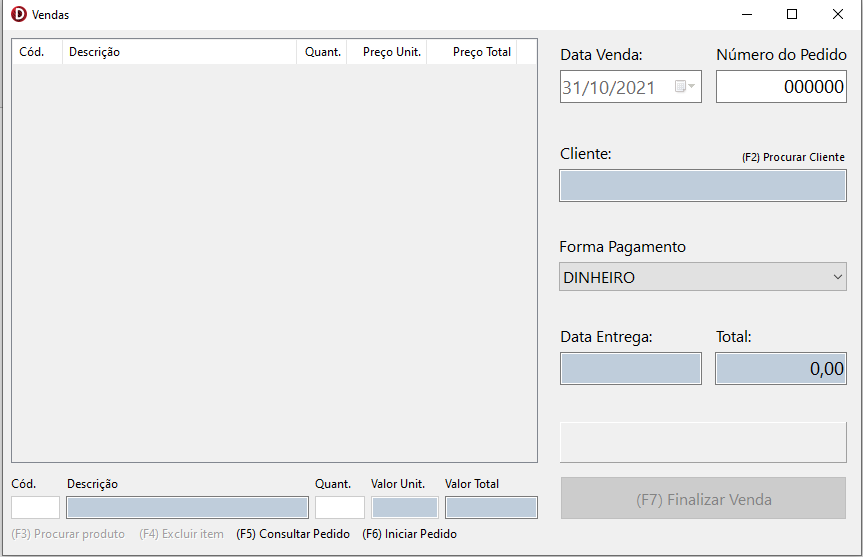

# Exemplo simples de aplicativo de Vendas usando padrão MVP

Os dados não persistem, ou seja, os dados cadastrados permanecerão disponíveis somente durante a execução da aplicação.
> Nota: Devido ao padrão MVP utilizado, é possível adicionar facilmente uma base de dados para persistência dos dados sem impactos nas camadas de View e Presenter.

### São 3 telas demonstrando as operações básicas de um CRUD:

- ⚡Cadastro de Clientes

  
  - Para adcionar um novo cliente, basta digitar o nome e em seguida clicar em Adicionar;
  - Para alterar o nome de um cliente já cadastrado, dê um clique duplo sobre o registro, então o nome do cliente aparecerá na caixa "Nome". Basta editar e clicar no botão com o nome "Atualizar";
  - Para excluir, selecione um registro e em seguida pressione as teclas Control + Delete.
  
- ⚡Cadastro de Produtos

  
  - Os comandos para Adicionar, Alterar e Excluir um registro, são os mesmos relacionados acima para a tela de clientes.
  
- ⚡Tela de Vendas/Pedidos

  
  > Nesta demonstração os tipos de formas de pagamentos são fixos, mas fica a dica de melhoria para inclusão de um MVP para as "Formas de Pagamentos".
  - Para incluir uma nova venda/pedido, pressione a tecla F6. Em seguida você deve selecionar um cliente previamente cadastrado, para isso, pressione a tecla F2, para chamar a tela de Procurar Clientes. Nesta tela, basta clicar duas vezes sobre o cliente ou pressionar a tecla enter quando o cliente escolhido estiver selecionado;
  - Escolha a forma de pagamento;
  - Agora é hora de adicionar os produtos. No campo "Cód." digite o código do produto previamente cadastrado e pressione a tecla enter. Caso não saiba o código do produto basta pressionar a tecla F3 para chamar a tela de Procurar Produtos;
  - Informe a quantidade no campo "Quant.", pressione a tecla enter 2 vezes. Pronto! o produto foi inserido na lista;
  - Caso queira excluir o produto, selecione o mesmo na lista e em seguida pressione a tecla F4, confirme a exclusão. Pronto! Exclusão feita!
  > Também é possível consultar vendas já finalizadas, mas somente após abrir a tela de vendas ou após finalizar uma venda. Segue os passos:
  > - No campo "Número do Pedido" informe o número do pedido que deseja abrir. Note que aqui você precisa saber o número do pedido! Após informar o número, pressione a tecla enter. Se existir uma venda/pedido para o número, será exibida na tela.
  > - Não é possível editar o pedido em consulta. Esta também pode ser uma ótima sugestão de melhoria!!!.
